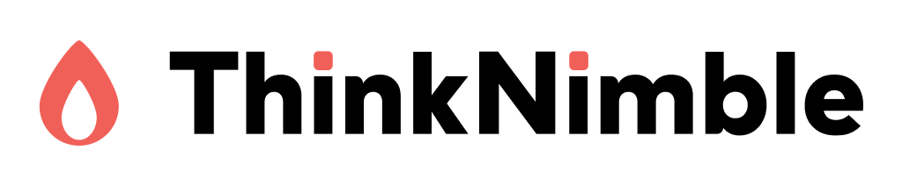

<p align="center">
  <a href="https://thinknimble.com">
    
  </a>
</p>

<h1 align="center">ThinkNimble Research Institute</h1>

<p align="center">
  <a href="https://research.thinknimble.com"></a>
  <a href="https://github.com/thinknimble/tn-research/actions"></a>
  <a href="https://jekyllrb.com"></a>
  <a href="LICENSE"></a>
</p>

<p align="center">
  <b>We don't know what "it" is, but we've been doing it for a long time.</b>
</p>

<p align="center">
  The world is like that. We are a group of builders, entrepreneurs, and downright<br>
  curious people trying to figure things out — just like you are, we expect.<br>
  <br>
  The mission of our so-called "Research Institute" is to share what we've learned<br>
  in order to help others navigate the world.
</p>

---

## What We Share

<table>
<tr>
<td width="33%" valign="top">

### Essays
**Deep explorations**

Long-form pieces that synthesize research, explore complex topics, and present original thinking on technology and its implications.

</td>
<td width="33%" valign="top">

### Digital Garden
**Knowledge building blocks**

Our collection of interconnected notes — short-form insights and observations that serve as atomic units of thought, linked wiki-style to form a knowledge graph.

</td>
<td width="33%" valign="top">

### Projects
**Things we've built**

Showcases of our work in software engineering, AI systems, and human-computer interaction — tools, experiments, and solutions we've created along the way.

</td>
</tr>
</table>

## Key Features

### Content Organization
- **Wiki-style linking** - Interconnected notes that build a knowledge graph
- **AI attribution system** - Transparent labeling of human-written, AI-supported, and AI-generated content
- **Status indicators** - Track content maturity from seed ideas to evergreen pieces
- **Author profiles** - Learn about our contributors and their areas of expertise

### Technical Excellence
- **Lightning-fast static site** - Built with Jekyll for optimal performance
- **Privacy-focused analytics** - Using Fathom instead of invasive tracking
- **Dark/light themes** - Automatic theme switching based on system preferences
- **Mobile-responsive** - Optimal reading experience on any device
- **Syntax highlighting** - Beautiful code examples with language-specific highlighting

## Local Development

### Prerequisites

- [Docker](https://www.docker.com/get-started) and Docker Compose
- [Just](https://github.com/casey/just) command runner (`brew install just`)
- Git

### Quick Start

```bash
# Clone the repository
git clone https://github.com/thinknimble/tn-research.git
cd tn-research

# Start the development server (with live reload)
just up

# Visit http://localhost:4001
```

The Docker setup automatically installs all dependencies and starts Jekyll with live reload enabled.

### Development Commands

```bash
# Start development server
just up

# Stop Docker containers
just down

# Rebuild Docker image
just build

# Clean all artifacts and Docker resources
just reset

# Run with drafts enabled
JEKYLL_DRAFTS=true just up

# Check for broken internal links
just check-links
```

### Creating Content

```bash
# Create a new note
just new-note "Your Note Title"

# Create a new essay
just new-essay "Your Essay Title"

# Create a new project
just new-project "Your Project Title"
```

These commands create properly formatted markdown files with all required frontmatter fields in the appropriate directories.

## Content Structure

### Collections

The site uses Jekyll collections to organize different content types:

```
_essays/          # Long-form essays and analysis
_notes/           # Atomic notes and knowledge fragments  
_posts/           # Blog posts (YYYY-MM-DD-title.md format)
_publications/    # Formal research publications
_projects/        # Project showcases and case studies
_authors/         # Author profiles and bios
```

### Front Matter Templates

> **Note**: Use `just new-note`, `just new-essay`, or `just new-project` to automatically create files with proper frontmatter.

<details>
<summary>Note Template</summary>

```yaml
---
layout: note
title: "Note Title"
date: YYYY-MM-DD
updated: YYYY-MM-DD
tags: [tag1, tag2]
attribution: human-written  # or ai-supported, ai-generated
authors: ["Author Name"]
status: budding  # or seed, evergreen
summary: "Brief description"
---
```
</details>

<details>
<summary>Essay Template</summary>

```yaml
---
layout: essay
title: "Your Essay Title"
subtitle: "Optional subtitle"
date: YYYY-MM-DD
authors: ["Author Name"]
attribution: human-written  # or ai-supported, ai-generated
abstract: "Brief summary"
readtime: "15 min read"
status: draft  # or seed, published
published: false  # or true
related_notes: [note-slug-1, note-slug-2]
---
```
</details>

<details>
<summary>Project Template</summary>

```yaml
---
layout: project
title: "Project Title"
subtitle: "Brief tagline"
date: YYYY-MM-DD
end_date: present  # or YYYY-MM-DD
status: active  # or completed, archived
banner_image: "https://..."
description: "Detailed description"
technologies:
  - Technology One
  - Technology Two
github_url: "https://github.com/..."
tags: [tag1, tag2]
---
```
</details>

<details>
<summary>Publication Template</summary>

```yaml
---
layout: publication
title: "Publication Title"
date: YYYY-MM-DD
authors:
  - Author One
  - Author Two
abstract: "Brief description"
attribution: human-written
pdf_url: "/path/to/pdf"  # optional
arxiv_url: "https://arxiv.org/..."  # optional
doi: "10.xxxx/xxxxx"  # optional
---
```
</details>

## AI Attribution Policy

We believe in transparency about AI use in content creation. All content includes an attribution field:

- **Human Written** - Created entirely by human effort
- **AI Supported** - Human-AI collaboration
- **AI Generated** - Primarily AI-created with human oversight

Learn more in our [AI Attribution Policy](https://research.thinknimble.com/notes/ai-attribution-policy).

## Deployment

The site automatically deploys to GitHub Pages when changes are pushed to the `main` branch. CloudFlare handles DNS and CDN services.

### Deployment Pipeline

1. Push to `main` triggers GitHub Actions
2. Jekyll builds the static site
3. Deploys to GitHub Pages
4. CloudFlare serves from research.thinknimble.com

## Project Structure

```
tn-research/
├── _includes/        # Reusable components
├── _layouts/         # Page templates
├── _essays/          # Essay content
├── _notes/           # Note content
├── _posts/           # Blog posts
├── _publications/    # Research publications
├── _projects/        # Project showcases
├── _authors/         # Author profiles
├── assets/           # Images and media
├── static/           
│   ├── css/         # Stylesheets
│   └── images/      # Site images
├── scripts/         # Utility scripts
├── _config.yml      # Jekyll configuration
└── index.html       # Homepage
```

## Tools & Utilities

### Link Checker
Check for broken internal links:

```bash
python3 scripts/check_internal_links.py
```

This tool:
- Scans all content for internal links
- Warns about missing wiki-style links (expected for planned content)
- Identifies actual broken links
- Ignores template variables and documentation files

## Contributing

We welcome contributions from the ThinkNimble team and the broader community.

### For ThinkNimble Team

1. Create a feature branch: `git checkout -b feature-name`
2. Make your changes
3. Test locally: `bundle exec jekyll serve`
4. Check links: `python3 scripts/check_internal_links.py`
5. Submit a pull request

### For External Contributors

1. Fork the repository
2. Create your feature branch
3. Make your changes
4. Submit a pull request with a clear description

### Content Guidelines

- Follow existing formatting and style conventions
- Include appropriate front matter
- Add AI attribution when applicable
- Use wiki-style links `[[Note Title]]` to connect ideas
- Test your changes locally before submitting

## License

- **Code**: Apache License 2.0
- **Content**: Creative Commons Attribution 4.0 International (CC BY 4.0)

See [LICENSE](LICENSE) for details.

## Support & Contact

- **Website**: [thinknimble.com](https://thinknimble.com)
- **Email**: hello@thinknimble.com
- **GitHub**: [@thinknimble](https://github.com/thinknimble)
- **Research Site**: [research.thinknimble.com](https://research.thinknimble.com)

---

<p align="center">
  Built with Jekyll • Hosted on GitHub Pages • Powered by curiosity
</p>